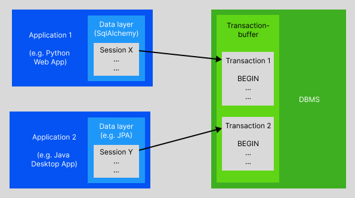
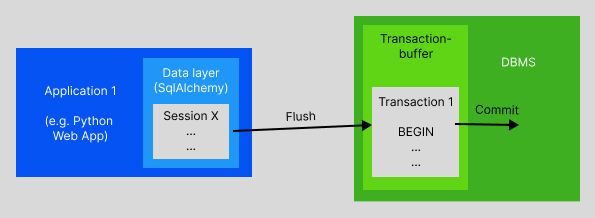

# How SqlAlchemy works

SqlAlchemy is a pretty complex framework for database-connectivity and all about SQL. It offers everything from emitting simple textual SQL to using DBMS-agnostic ORM. Thus, getting lost is easy. This introduction does not replace reading the official docs and the great tutorial but instead tries to add those background information which are often missing in the official docs and deliver the context needed to fully understand how all the concepts work together.

## Up front: Key concepts and what's always given

SqlAlchemy divides it's API into two bigger concepts: "Core" and "ORM". However, it makes sense to make it even three to include textual SQL as well, so let's break it down to these three main concepts:

1) *Textual SQL:*
   
   Connecting to a database and emitting textual SQL. This is the most basic way, here we use SqlAlchemy only to connect to a database and do the old-fashioned, plaintext-SQL-work. We work with the SqlAlchemy objects "Engine" to set up connectivity, the "Connection" to emit statements we wrap in the "text()"-construct and the "Result" to receive data from the database. (We mainly mention it here to underline that really no other SQL-tools are required to work with databases in the Python-ecosystem aside from SqlAlchemy.)

2) *Core*: 

   Describing the database structure with metadata in Python and creating statements directly in Python based on that metadata. In this moment, we are database-agnostic and don't write textual SQL on our own anymore. We mainly add the SqlAlchemy objects "MetaData", "Table" and "Column" to our toolset to be able to describe the database structure (plus many classes to describe column types, foreign keys and so on) and the Sql-statement-constructs such as "select()", "insert()" etc. to replace the textual SQL with Python-constructs.

3) *ORM:*

   Mapping SQL-tables and their columns to Python-objects (rather more classes) and their attributes. Here we make the step from working with database-logic to working with domain-objects. To achieve that, we need again to add some SqlAlchemy-objects to our toolset, which are the "registry" and "Mappers" to set up these mappings and the "Session" as our way of connecting to the database in the context of ORM (this "Session" more or less replaces the "Connection" in the moment we want to use SqlAlchemy's ORM).

When using SqlAlchemy, some really important basic things are always guaranteed to be happening. These include:

- **Escaping**: Automatically generated SQL-statements are always escaped. When using textual SQL, always use the bind-parameters-syntax and you'll be on the safe side. This way, there are no chances for SQL-Injections.
- **Transactions**: SqlAlchemy emits statements always in the context of a database-transaction. This happens no matter whether you use the ORM, SqlAlchemy-Core-constructs or textual SQL.

## On Database-Transactions

It is crucial to understand what database transactions are and how they typically work to understand what's really happening when we use SqlAlchemy to emit statements against a database.

SqlAlchemy **always** uses transactions, so be ensured that this knowledge really is important to understand the effects of emitting statements.

### Transactions-buffer

Database-transactions are something like a buffer in the DBMS that shall ensure data integrity in the moment where more than one user/application tries to modify the same data or when something technically goes wrong. In this context, the keyword is "ACID" or the ***ACID-properties*** (atomicity, consistency, isolation, durability), respectively. As Wikipedia states: 

> "In computer science, ACID (atomicity, consistency, isolation, durability) is a set of properties of database transactions intended to guarantee data validity despite errors, power failures, and other mishaps. In the context of databases, a sequence of database operations that satisfies the ACID properties (which can be perceived as a single logical operation on the data) is called a transaction."

Whenever someone starts a transaction (with **BEGIN**), a new transaction-context for this user is created within this transaction-buffer of the DBMS. If another user starts another transaction, a second transaction-context is created within this buffer.

Whatever happens within a transaction only takes place within this transaction-buffer (more or less, details follow below). Even though it may look like the data-changes are already persisted to the database, they are not (which means that e.g. primary keys are already created in the transaction-buffer, so it definitely looks like everything is already finally persistet even though it isn't). It will only be really *"materialized"* to the database when the user commits the transaction (with **COMMIT**). If he doesn't, all not yet committed changes will never be transfered from the transaction-buffer to the actual database, so they will be lost again. Another option is to intentionally rollback all pending changes of the current transaction (with **ROLLBACK**), e.g. in case something goes wrong.

We can imagine this whole setup as follows:



### Flushing and Commiting

There are two different mechanisms to differentiate in handling the transaction: **Flush** and **Commit**:
- **Flushes** can be emitted manually but are often emitted automatically by SqlAlchemy as well, e.g. before executing a SELECT-statement or before commiting the transaction. The flush moves changes from the SqlAlchemy-Session to the transaction-buffer of the DBMS.
- **Commits** are emitted manually by the user (as long as *auto-commit* has not been configured to happen). Commits finally move changes from the transaction-buffer to the DBMS, so a commit really materializes state-changes in the database.

These two mechanisms can be illustrated as follows:



### Transaction-isolation

It is a matter of configuration to what extend two (or more) transactions are really isolated from each other. This is called the level of transaction-isolation. It defines how much of the data-changes of a transaction is visible to the database and other transactions. Usually, there are 4 different levels to differentiate:

1) **READ UNCOMMITED**:
   
   From SqlAlchemy's docs:

   > One of the four database isolation levels, read uncommitted features that changes made to database data within a transaction will not become permanent until the transaction is committed. However, within read uncommitted, it may be possible for data that is not committed in other transactions to be viewable within the scope of another transaction; these are known as “dirty reads”.

2) **READ COMMITED**:

   From SqlAlchemy's docs:

   > One of the four database isolation levels, read committed features that the transaction will not be exposed to any data from other concurrent transactions that has not been committed yet, preventing so-called “dirty reads”. However, under read committed there can be non-repeatable reads, meaning data in a row may change when read a second time if another transaction has committed changes.

3) **REPEATABLE READ**:

   From SqlAlchemy's docs:

   > One of the four database isolation levels, repeatable read features all of the isolation of read committed, and additionally features that any particular row that is read within a transaction is guaranteed from that point to not have any subsequent external changes in value (i.e. from other concurrent UPDATE statements) for the duration of that transaction.

4) **SERIALIZABLE**:

   From SqlAlchemy's docs:

   > One of the four database isolation levels, serializable features all of the isolation of repeatable read, and additionally within a lock-based approach guarantees that so-called “phantom reads” cannot occur; this means that rows which are INSERTed or DELETEd within the scope of other transactions will not be detectable within this transaction. A row that is read within this transaction is guaranteed to continue existing, and a row that does not exist is guaranteed that it cannot appear of inserted from another transaction.  
   >
   > Serializable isolation typically relies upon locking of rows or ranges of rows in order to achieve this effect and can increase the chance of deadlocks and degrade performance. There are also non-lock based schemes however these necessarily rely upon rejecting transactions if write collisions are detected.

The fifth option is called **AUTOCOMMIT** and effectively avoids the transactional character of the connection and directly persists any change to the database. This especially means that there is no option for a rollback. Technically, using AUTOCOMMIT means that each single SQL-statement is executed as an own transaction which is directly commited.

The isolation level can be set per connection/session or for the engine, meaning as the default for all connections/sessions based on that engine.

If not explicitely configured, the **default-transaction-isolation** of the currently used DBMS will be used. These are:

- PostgreSQL: READ COMMITTED
- MySQL (InnoDB): REPEATABLE READ
- SQLite: SERIALIZABLE
- Oracle: READ COMMITTED
- SQL Server: READ COMMITTED

## The two worlds of the ORM: In-memory with the session and persistent in DB:

When using the ORM, we always need to keep in mind that the certain set of
records we are currently working on exist in two worlds: They live in the
memory in shape of ORM-mapped Python-objects and they live in the database.

SqlAlchemy's session-object organizes all that, it manages the ORM-mapped
objects and keeps track of the differences compared to the database. It always
works in the context of a database-transaction and flushes changes every now
and then (or when we explicitely ask it to do so). Once we commit all changes,
the session will finally flush all pending changes to the transaction-buffer and
ask the DBMS to commit this transaction.

Now there are a lot of mechanisms in a DB we usually want to use, like
constraints or cascades etc. Now what we need to keep in mind: We can set up
these mechanisms (like cascading) on the DB but as well on the ORM-world. Let's
check that out to understand the difference:

In the metadata we define to describe our database-structures, we can define
constraints and their behaviour, e.g. like here:

```
card_has_tag_table = Table(
    "Card_has_Tag",
    metadata,
    Column(
        "id_card",
        Integer,
        ForeignKey("Card.id", ondelete="CASCADE"),
        primary_key=True,
    ),
    Column(
        "id_tag",
        Integer,
        ForeignKey("Tag.id", ondelete="CASCADE"),
        primary_key=True,
    ),
)
```

These "`ondelete`"-parameters tell SqlAlchemy that the DB-table shall configure
the ForeignKey-relationship such that DELETE cascades. So this will directly
end up in the database as constraints!

Having that in place usually makes sense and reduces the risk of data-integrity-
issues etc. However, there is as well a way to set the very same up in the ORM-
world. This is done in the definition of our mapping:

```
mapping_registry = registry()
mapping_registry.map_imperatively(
   Card,
   card_table,
   properties={
      "tags": relationship(
            Tag,
            secondary=card_has_tag_table,
            collection_class=set,
            lazy="immediate",
            cascade="all",
      ),
      "relevance": relationship(
            Relevance,
            lazy="immediate",
            cascade="save-update, expunge",

            # Don't choose "all" because of delete: "all" would include
            # delete, which would lead to the following problem:
            # If a card shall be deleted, the session would then
            # automatically cascade this delete-command as well to
            # the relevance-object that is connected to the card.
            # But we can expect that re thelevance-record in DB is as well
            # connected to other cards (normal 1:n-situation in DB).
            # Deleting the ORM-mapped relevance-object would issue
            # SQL-statements to delete the corresponding DB-record.
            # This again is very likely to not work because the DB cannot 
            # violate that foreign-key-constraint as this relevance-record
            # is very likely to be connected to other cards in DB already.
            # 
            # We always need to differentiate between the ORM-objects and
            # the DB-records. The cascade-parameter here deals with the
            # cascading within the ORM-object tree. The cascading in the DB
            # is defined in the SqlAlchemy-Table-objects with parameters of
            # the ForeignKey-class ("ondelete" and "onupdate"). These
            # parameters result in DDL that adds these constraints to the
            # DB-schema.
      ),
   },
)
```

See the comment in the code above. Here we define the cascading within the ORM-
mapped object-tree, so all changes take already place in the memory before we
flush anything to the database.


## About expiring and expunging

When working with sessions to retrieve objects from DB, we often run into the
situation that we want to already close the session but need to returned objects
in subsequent steps. This especially is a result from our architecture where we
want to encapsulate the database but of course still need the data in some other
places (like e.g. to return them to a user via web-API.)

Here we run into a situation, because in ORM-mappers there is the concept of
"expiring", which is totally making sense but is somewhat in our way here:

In several situations, ORM-mapped objects are set to be "expired". This is for
example the case if a session is committed. In this moment, SqlAlchemy says
"well i just committed a transaction, i honestly have no idea how the data you
have been working on does look like right now after committing since someone
else might as well just modified that!". And this is totally correct! So what it
does is it sets the objects that have been part of that session to be "expired".
This has a very important effect: Whenever we access the attributes of such an
object, SqlAlchemy will try to synchronize them with their current DB-data by
using the session. But often in this very moment, we want to the session to be
already closed. And this will lead to an exception! So what shall we do now?

First let's see in which situations objects are marked as expired:
- after committing the session
- after rolling back the session
- after closing the session

Our problem occurs in the moment the session is closed, because then there is no
chance anymore for SqlAlchemy to use that session to get the current data from
DB. If a session is closed, all its objects become "detached", so to be precise:
Detached objects with expired attributes are our problem, because "expired"
means that SqlAlchemy wants to update them and "detached" means it has no
session to do so. But being detached is exactly what we often want our objects
to be to use them on other subsequent steps.

So our target is to get detached objects without being expired. And this is
possible to achieve with the session's "expunge"-method! Expunging means that
we rip of that expunged object from the session, but without setting its state
to be "expired". And here we are, that's what we need to do.


### An important fun-fact:

The behaviour of "refreshing" objects is different in debugging mode and in
normally executed code. Never just test something out in your debugger!!


Use case: Returns detached objects to use them for templates or as a JSON-
response.

This means that we need to ensure that the ORM-objects don't have expired
attributes because this would lead to a reload once those are accessed. Since
attributes always get expired if the session is closed or a rollback takes
place (or a commit if the session flag "expire_on_commit is set to true -
which is its default value), we need to expunge them before the session is
rollbacked or closed.

What's happening here is totally NOT trivial or intuitive. It is definitely
important to understand this in very detail, so always come back here for
reference, let's talk in through in detail:

- An instance is bound to its session, the session manages the state of the
instance.
- There are a couple of states, some of them are important in this context:
   - detached: The instance is not connected to the session anymore, this
               is kind of our target.
   - expired: The attributes of an instance become expired in the following
               situations:
               a) the session is commited.
               b) the session is rolled back
               c) the session is closed: then the instance automatically
                  gets detached, too.
               If an attribute is expired, it will definitely need to ask
               the session for its current database-data in the moment this
               attribute is accessed. This is exactly then a problem when
               there is no session anymore connected to this instance. In
               this situation, sqlalchemy will raise an error.
- Having no session anymore is a problem for an instance if there
is a need to update some of its data again. There are typically two
situations where this might be required:
   1) We need to use an expired attribute of that instance.
   2) We need to use an attribute which is lazy-loaded in the meaning that
      this attribute (or typically a relationship-object) has not yet been
      loaded at all.
- Now the usual mistake is as follows: We use a session, query the database,
close the session and then return all the queried objects. In the moment
we access any of its attributes, we will get the 'detached instance'-
error. So why is that: Because after closing the session, all attributes
get expired, and in the moment an attribute is expired, accessing it means
by a 100% that it will definitely need a session to get its current data
from the database via a session. No chance of getting around that. But
closing a session means the objects have no session anymore to do so (they
are now in 'detached'-state), so -> Error.
- In our situation here, aside from closing the session the unit-of-work-
construct as it is set up here would even do a rollback before closing the
session, which would as well already set all attributes to 'expired'. So
in any case, here in our lovely setup with all its advantages, we have the
issue of expired attributes/instances and detached objects.
- So what now, how can we solve that? We need to take care of both
situations above, the expiring of the instance due to the mechanisms of
sqlalchemy and the lazy-loading. The latter is no problem: We can simply
define the mapping of relationships to handle the lazy-loading with the
'immediate'-mode, which basically means that there is no lazy-loading but
eager-loading: problem solved! All relationship-objects get loaded
directly with their main instance-object, no further database-queries
are required. Done.
- Still, even those will get expired once any of the mechanisms described
above will happen (rollback, closing, commiting). By the way, commiting a
sessino usually sets all attributes to be expired as well. But in this
most simple case we have here ('get my objects from the database and
that's it.), we do not even have any change to commit. So setting the flag
'expire_on_commit' to False (as suggested in the official docs) doesn't
help at all here (even though it would na do any harm as well). However,
so how to deal with this now, how do we get our instances out of the
session without expiring their attributes?
- With the 'expunge()'-method from the session!! That's our saviour!
This method releases the instances into their freedom, cutting all
connections to their session, but without setting their attributes to
expired. This way, since they are not marked as expired they will not try
to update their values in they moment we access them. So the expunge()-
method is our hero here, it is definitely not some 'weird other method',
it is the one thing we need to make our key-requirement work: Querying the
database, getting ORM-objects but closing the session while still being
able to use these instances and access their attributes without causing a
reload-query against the database without having any session anymore.
So the 'expunge()'-method is our shining star, we need it, it is
something every developer needs to know in this specific context. It is
nothing we can avoid when learning sqlalchemy!